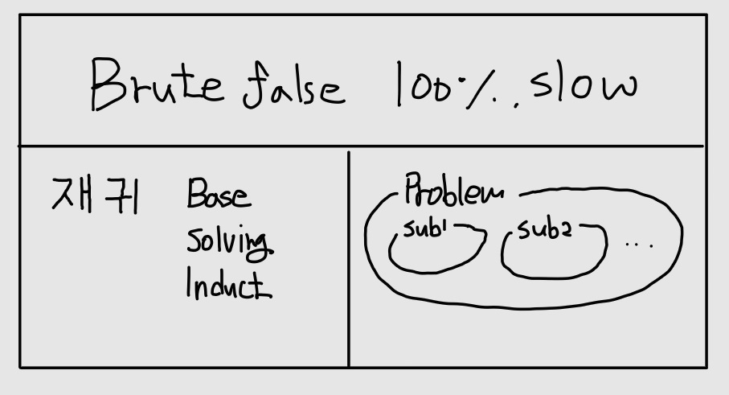

## 1.무식하게 풀기란?
모든 경우의 수를 계산하여 답을 찾는 방법이다.
예외가 없기 때문에 항상 정답이며, 속도가 빠른 컴퓨터의 장점을 살릴 수 있다.
문제를 풀 수 있는 가장 비효율적인 방법이며 제일 먼저 시도할 수 있는 방법이다.

## 2.재귀
문제를 조각으로 쪼개어 일부분을 자신이 해결하고 나머지는 자신을 호출하여 해결하는 방법이다. 무식하게 푸는 방법은 재귀함수로 구현하는 것이 좋다.
### 2.1.재귀함수 구성
재귀함수는 3가지 요소를 포함해야 한다.
아래는 피보나치 수열을 구하는 재귀함수다.
```c
int fibonacci(int n) {
  if ( n <= 1 ) {
    return n;
  }
  return fibonacci(n-1) + fibonacci(n-2);
}
```

1. 기저사례(base case)
기저 사례는 문제가 **더이상 쪼게지지 않는 부분**으로 재귀함수가 마지막으로 호출되는 부분이다. 기저 사례가 존재하지 않으면 재귀함수는 무한루프에 빠져 오류를 일으킨다. 피보나치 수열의 기저사례는 n이 1보다 작거나 같을때의 조건이다.

2. 문제해결부분
재귀함수는 문제의 **일부를 해결하는 부분**이 포함되어야 한다. n-1의 수열과 n-2의 수열을 더하는 동작이 문제의 일부를 해결하는 부분이다.

3. 자기호출 부분(inductive case)
재귀함수는 자기자신을 호출해야만 한다. n-1의 수열과 n-2의 수열을 fibonacci 함수를 호출하여 해결하는 부분이 자기호출 부분이다.

## 문제와 부분문제
**문제**란 특정한 입력이 주어질 때 원하는 출력을 구하기 위한 작업이다.**부분 문제**란 문제를 풀기 위해 필요한 정보들을 구할 때 생기는 또다른 문제이다. 피보나치 수열은 n을 풀기 위해서는 피보나치 수열 n-1과 피보나치 수열 n-2를 구해야하기 때문에 부분문제라 볼 수 있다.

## 중복 제거

## 최적화 문제

## 결론
1. 문제를 읽고 문제를 정의한다.
2. 문제를 부분 문제로 쪼갠다.
3. 문제를 재귀함수로 구현한다.
